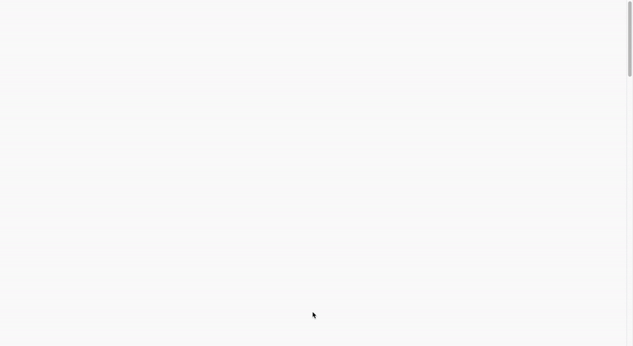

# Spotfolio

A portfolio template built with Next.js that uses the Spotify API to let you optionally showcase your music preferences. This repo was forked from the Cleanfolio repo which you can find [here](https://github.com/rajshekhar26/cleanfolio).

## Differences between this project and Cleanfolio

- This project uses the [Next.js](https://nextjs.org/) framework which lets you take advantage of Next.js [API Routes](https://nextjs.org/docs/api-routes/introduction) among other features. API Routes allow you to build both the site's front-end and its API with the same framework and deploy them to the same environment ([Vercel](https://vercel.com)).

- Integration with the [Spotify API](https://developer.spotify.com/documentation/web-api/) to let you **optionally** showcase the song you're currently listening to and/or your top tracks

- Improved README documentation

- Improved user interface

## Preview



[Live Demo](https://spotfolio.vercel.app/)

## Usage

### Running Locally

npm

```shell
git clone https://github.com/magic-ike/spotfolio.git
cd spotfolio
npm install
npm run dev
```

yarn

```shell
git clone https://github.com/magic-ike/spotfolio.git
cd spotfolio
yarn
yarn dev
```

### Making Changes

- Go to `pages/_app.js` and replace `<title>John Smith</title>` with `<title>Your Name</title>`.

- Go to `data/portfolio.js` and replace the dummy data with your own.

- To add a favicon to your site, put your `favicon.ico` file directly in the `public` folder.

### Spotify (Optional)

To get the Spotify data to populate locally, you'll need to create a `.env.local` file in your root directory to store some environment variables. Create the file and paste in the following code:

```shell
SPOTIFY_CLIENT_ID=$CLIENT_ID
SPOTIFY_CLIENT_SECRET=$CLIENT_SECRET
SPOTIFY_REFRESH_TOKEN=$REFRESH_TOKEN
```

To get the Client ID, Client Secret, and Refresh Token, you'll need to do the following:

- Go to your [Spotify Developer Dashboard](https://developer.spotify.com/dashboard/applications) and log in.

- Click **Create an App**.

- Fill out the name and description and click **Create**.

- Click **Show Client Secret**.

- You should now see the Client ID and Client Secret. Save these for later.

- Click **Edit Settings**.

- Add `http://localhost:3000` as a redirect URI and click **Save**.

- Navigate to the following URL in your browser (replace `$CLIENT_ID` with your actual Client ID):

```shell
https://accounts.spotify.com/authorize?client_id=$CLIENT_ID&response_type=code&redirect_uri=http
%3A%2F%2Flocalhost:3000&scope=user-read-currently-playing%20
user-top-read
```

- After authorizing, you should be redirected to your redirect URI. In the URL, there should be a **very long** `code` query parameter like so:

> localhost:3000/?**code=NApCCg..BkWtQ**

- The value after `code=` is your Authorization Code. Save it for later.

- Now we're ready to get the Refresh Token. Run the following cURL command in your terminal (replace `$CLIENT_ID`, `$CLIENT_SECRET`, and `$CODE` with your actual Client ID, Client Secret, and Authorization Code respectively)

```shell
curl -d client_id=$CLIENT_ID -d client_secret=$CLIENT_SECRET -d grant_type=authorization_code -d code=$CODE -d redirect_uri=http://localhost:3000 https://accounts.spotify.com/api/token
```

- You should get the following JSON response:

```shell
{
    "access_token": "$ACCESS_TOKEN",
    "token_type": "Bearer",
    "expires_in": 3600,
    "refresh_token": "$REFRESH_TOKEN",
    "scope": "playlist-modify-private"
}
```

- Save `$REFRESH_TOKEN` as this is your Refresh Token. This token will last for a very long time unless you revoke access.

- After running the last command, you may instead get the following output:

```shell
{
    "error": "invalid_grant",
    "error_description": "Authorization code expired"
}
```

- In that case, just repeat the step where you navigate to the `https://accounts.spotify.com/authorize...` URL in your browser, then repeat the steps after that.

- If everything went smoothly, you should now have the Client ID, Client Secret, and Refresh Token. Plug those 3 credentials into the `.env.local` file and you should be good to go.

### Deployment

- Go to [Vercel](https://vercel.com/dashboard) and sign up for an account if necessary.

- Click **New Project**.

- Import your repository. This should take you to the project configuration screen.

- **(Optional)** If you want your Spotify data to populate on your live portfolio, you'll need to grab the environment variables you added to your local environment and add them to this environment. Expand the **Environment Variables** dropdown and add the following name-value pairs:

| NAME                  | VALUE (WILL BE ENCRYPTED) |
| --------------------- | ------------------------- |
| SPOTIFY_CLIENT_ID     | Your Client ID            |
| SPOTIFY_CLIENT_SECRET | Your Client Secret        |
| SPOTIFY_REFRESH_TOKEN | Your Refresh Token        |

- Click **Deploy**.

- If everything went smoothly, your portfolio should now be live. Congrats! 🎉

## License

[MIT](https://choosealicense.com/licenses/mit/)
